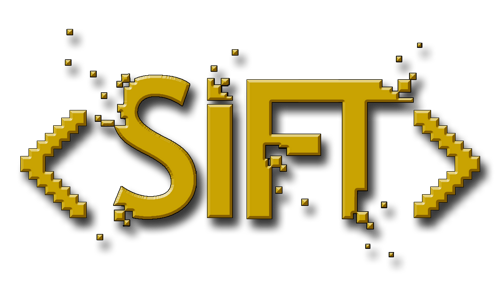

      
SIFT is a static language analyser.
[](https://travis-ci.org/Rosme/sift) [](https://ci.appveyor.com/project/Rosme/pfe)

### License
The source code and the project is distributed under the MIT license, unless specified otherwise.
Copyright(C) Jean-Sébastien Fauteux, Michel Rioux, Raphaël Massabot.
### Quick Start
To quickly get started with SIFT, just follow these three steps:

* *(Optional) Copy SIFT in the folder containing the source you want to parse*
* Create a rules.json there (see sample below)
* Run SIFT

Here is an example rule file to get you started, 
```json
{
  "rules": [
	    {
	      "rule": "NoAuto"
	    },
	    {
	      "rule": "MaxCharactersPerLine",
	      "parameter": "80"
	    },
	    {
	      "rule": "StartWithX",
	       "parameter":"m_",
	       "appliedTo":"Variable"
	    }
    ]
}
```
And here's an example on how to execute sift:
```bash
./sift . 
```
It'll look for a rules.json wherever you are and parse the directory or file you provide.
### Usage
Once SIFT is build, you may use it like so:
```bash
./sift --path "source/to/test" --rules "your_rule_definition.json" --output "your_output_file"
```
It's also possible to invoke SIFT's help like so:
```bash
./sift --help
```
### Building
* mkdir build
* cd build
* cmake ..
* cmake --build .
### Conventions
* Indentation is 2 spaces
* Bracket style is [1TBS](https://en.wikipedia.org/wiki/Indentation_style#1TBS)
 * _if_ with just 1 instruction still needs brackets
* macros should be avoided
* Class members should start with m_
* m_camelCase of anything and everything
* Usage of C++11/C++14 as much as possible
* Usage of pragma once should be favorised
### Extending SIFT
SIFT is, in theory, capable of being extended to other languages. To do so you may inherit from the interface [...]
